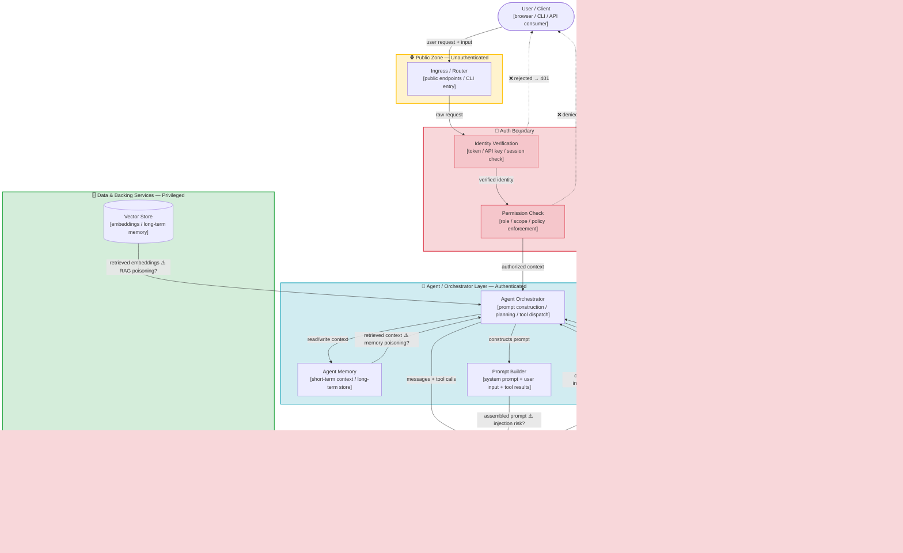
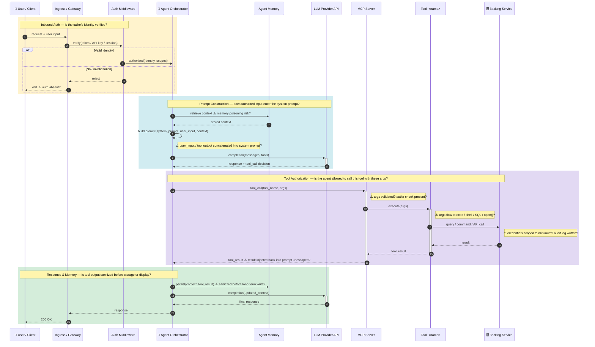

# Architecture Diagram Guide — AI-Native Codebases

Produces two Mermaid diagrams for use in Phase 1 (threat modeling):

1. **Data Flow Diagram (DFD)** — trust boundary map showing where data moves and where
   authorization controls exist or are missing.
2. **Agent Tool-Call Sequence** — step-by-step flow from user request through the LLM to tool
   execution and backing-service response, with security control checkpoints annotated.

Both diagrams must be populated by systematically extracting evidence from the codebase (§ Info
Capture below) before any diagram is drawn. Do not guess topology from file names alone.

---

## Template 1 — AI-Native Data Flow Diagram

Replace placeholder node names with actual component names found in the code. Add or remove
zones as needed (e.g., omit the MCP Tools zone if no MCP server is present). Annotate missing
controls with `⚠️`.



---

## Template 2 — Agent Tool-Call Sequence

Traces the exact path from user input to tool execution and response. Annotate each security
checkpoint with `⚠️ control absent?` where evidence from the code shows the check is missing.



---

## Info Capture — 6-Phase Extraction Process

Run each phase against the actual codebase before drawing either diagram. Record findings in
a scratch table; the table becomes the input for Phase 1.2 (Component Inventory).

### Phase 1 — Entry Points

**Goal:** Find every place external input enters the system.

**What to look for:**

| Target type | File / directory signals | Code signals |
|-------------|-------------------------|-------------|
| HTTP routes | `routes/`, `controllers/`, `handlers/`, `endpoints/`, `api/`, `views/` | String path + HTTP verb; decorator on function/class; registration call mapping path → function |
| CLI / cron | `cli.py`, `__main__.py`, `Makefile`, `cron`/`scheduler` | `argparse`, `click`, `typer`, `@app.command()`, cron expressions |
| MCP tools | `@mcp.tool`, `FastMCP`, `server.py`, `tools.py` | Tool-decorated functions; `tool_definitions` list; JSON-RPC handler registration |
| Agent entry | `agent.py`, `assistant.py`, `run.py` | `client.messages.create()`, `ChatCompletion.create()`, `agent.run()`, `crew.kickoff()` |
| Hooks / plugins | `hooks/`, `SKILL.md`, `.claude-plugin/` | Pre/post tool-use bash scripts; `plugin.json`; `BaseTool._run()` |

**Output:** `{ type, file:line, method/verb, protected? }`

### Phase 2 — Auth & Permission Controls

**Goal:** Map exactly where identity is verified and where access is enforced — and where it is
absent.

**Inbound auth (user → agent):**

| Signal type | Keywords to grep |
|------------|-----------------|
| Token parsing | `decode`, `verify`, `validate`, `bearer`, `jwt`, `session_id`, `cookie`, `Authorization` |
| API key check | `x-api-key`, `api_key`, `ANTHROPIC_API_KEY`, header comparison |
| Credential comparison | `bcrypt`, `argon2`, `compare`, `verify_password`, `check_password` |

**Agent → LLM provider auth:**
- How is the API key loaded? Source code literal (`sk-ant-…`) vs. `os.environ` vs. secrets manager?
- Is the key logged? Does it appear in error messages or exception tracebacks?

**Agent → MCP server auth (if applicable):**
- Is there a shared secret, OAuth token, or mTLS between the agent and its MCP client?
- Does the MCP server validate caller identity, or does it accept all connections?

**MCP tool → backing service auth:**
- Per-tool: what credential does each tool use to call its backend (DB, email, API)?
- Scope: is it a broad admin credential or a minimally-scoped service account?
- Storage: hardcoded, env var, or secrets manager?

**Authorization (what can you do?):**

| Signal | Keyword |
|--------|---------|
| Role/scope check | `role`, `permission`, `scope`, `policy`, `allowed`, `forbidden`, `can`, `ability` |
| Object ownership | `owner_id`, `user_id`, `created_by`, `tenant_id` — compared against request identity |
| Tool-level authz | Check in MCP tool code before calling backend: is there any `if not authorized` guard? |

**Output:** `{ component, auth_mechanism, auth_present?, authz_present?, notes }`

### Phase 3 — Data Stores

**Goal:** Map every location where data is read from or written to, and assess query safety.

| Store type | Signals |
|-----------|---------|
| Relational DB | ORM import (`sqlalchemy`, `django.db`, `prisma`, `gorm`); query keywords (`SELECT`, `INSERT`, `find`, `save`, `execute`); string interpolation in query → ⚠️ SQL injection |
| Vector store / embeddings | `chromadb`, `pinecone`, `weaviate`, `pgvector`, `faiss`, `embed()`, `upsert()`, `similarity_search()` |
| Agent memory | `memory.add()`, `memory.search()`, `ConversationBufferMemory`, long-term store writes from tool results or user input |
| File / object store | `open()`, `Path.write_text()`, `s3.put_object()`, presigned URLs; path constructed from user input → ⚠️ path traversal |
| Cache / session | `redis`, `memcache`, `cache.set()`, `session[key]` |

**Flag:** Any store written to using unvalidated input from the user, tool output, or fetched web content.

**Output:** `{ store_type, file:line, access_pattern, parameterized?, written_from_untrusted? }`

### Phase 4 — Outbound Connections

**Goal:** Find all calls to external services and audit how credentials are handled.

| Connection type | Signals |
|----------------|---------|
| LLM API call | `openai.chat.completions.create()`, `anthropic.messages.create()`, `genai.generate_content()` |
| MCP tool → backing service | HTTP client calls inside tool functions (`requests.get/post`, `httpx.AsyncClient`, `aiohttp`) |
| Email / calendar | `smtplib`, `sendgrid`, `gmail API`, `exchange`, `O365` |
| Code execution | `subprocess`, `os.system`, `exec()`, `eval()`, REPL clients |
| Web fetch | `requests.get(url)` where `url` is derived from user or tool input → ⚠️ SSRF |

**For each outbound call, record:**
- Target: service name or URL pattern
- Credential source: hardcoded | env var | secrets manager | OAuth token | none
- URL origin: static config | user-supplied | LLM-generated | tool output → flag LLM/user-derived URLs

**Output:** `{ target, credential_source, url_origin, file:line }`

### Phase 5 — Trust Boundary Classification

**Goal:** Assign each component to a zone; flag all cross-boundary flows that lack controls.

| Zone | Components | Rule |
|------|-----------|------|
| Public Zone | Ingress, CLI entry, public HTTP routes | Reachable with no auth upstream |
| Auth Boundary | Auth middleware, token verifier, permission check | Sole purpose is identity/permission check |
| Agent/Orchestrator Layer | Agent code, prompt builder, planner | Executes only after auth boundary is passed |
| MCP Tools Layer | MCP server, individual tool functions | Invoked by agent; has own credential set for backends |
| LLM Provider Zone | External LLM API | Third-party; outside your trust perimeter |
| Data/Backing Services | DB, vector store, filesystem, email, shell | Never directly reachable from Public Zone |

**Cross-boundary flows to flag as threat surfaces:**

| From | To | Missing control | Threat category | Priority |
|------|----|----------------|----------------|---------|
| Public Zone | Agent Layer | Auth boundary absent | Broken Access Control | Critical |
| Agent Layer | MCP Tools | No per-call authz check in tool | Broken Access Control / Tool Abuse | High |
| Agent Layer | LLM Provider | User input in system prompt | Prompt Injection | High |
| MCP Tool | Data/Backing | No input validation before DB/shell call | Command/SQL Injection | High |
| Agent Layer | Agent Memory | Tool result / web content written unsanitized | Memory Poisoning (T1) | High |
| MCP Tool | External Service | URL derived from LLM output or user input | SSRF (P1) | High |
| Agent Layer | Agent Layer | No mutual auth between agents (multi-agent) | Identity Spoofing (T9/T13) | Medium |
| Auth Boundary | Data Layer | Token/session stored in plaintext or source | Sensitive Data Exposure | Medium |

### Phase 6 — Diagram Construction Prompt

Assemble the extracted evidence into a structured summary, then use it to populate the Mermaid
templates above. Replace every placeholder node with a real component name. Add a `⚠️` annotation
on every edge where Phase 5 flagged a missing control.

```
[ENTRY POINTS]
  <list from Phase 1: type | file:line | protected?>

[AUTH CONTROLS]
  <inbound, agent→LLM, agent→MCP, tool→backend from Phase 2>
  <components with no auth identified>

[DATA STORES]
  <stores from Phase 3: type | access pattern | written from untrusted?>

[OUTBOUND CONNECTIONS]
  <external calls from Phase 4: target | credential source | url origin>

[TRUST BOUNDARY MAP]
  <zone assignments from Phase 5>
  <flagged cross-boundary flows with missing controls>

Instruction:
  "Using only the information above, generate:
   1. A DFD Mermaid diagram (graph TD) following the AI-native template, replacing
      placeholder nodes with the actual components found. Add ⚠️ on edges where a
      security control is absent or bypassed.
   2. An Agent Tool-Call Sequence diagram (sequenceDiagram) tracing the primary
      user-request → LLM → tool-call → backing-service flow, annotating each
      checkpoint with ⚠️ where evidence shows the control is missing."
```

---

## Connecting Diagrams to Phase 1.2 and 1.3

**Phase 1.2 Component Inventory** — every node in the DFD is a row in the inventory table:
- Node label → `component` name
- Subgraph it belongs to → `trust_zone`
- Outgoing edge labels → `capabilities`
- Data flowing through the node → `data_handled`
- Credential source from Phase 4 → `credentials`

**Phase 1.3 Threat Enumeration** — every `⚠️`-annotated edge in the DFD is a candidate threat:
- Public Zone → Agent Layer (no auth) → `TM-NNN: Broken Access Control`
- Agent prompt builder → LLM (user input in system prompt) → `TM-NNN: Prompt Injection`
- MCP tool → DB (string-interpolated query) → `TM-NNN: SQL Injection`
- Memory write from tool output → `TM-NNN: Memory Poisoning (T1)`

Each `⚠️` in the sequence diagram maps to a specific code location and becomes a vulnerability
finding entry in Phase 2 if confirmed by code inspection.
