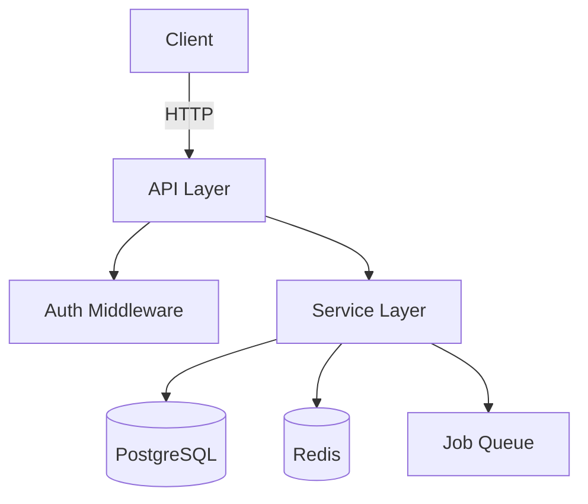
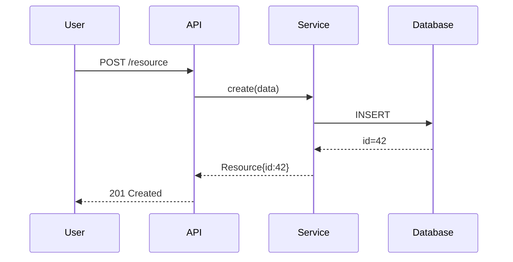

## What This Skill Does

Given a repository (local path or GitHub URL) and a destination directory, generates a comprehensive developer wiki:

- Walks the repository and identifies key source files
- Plans a logical wiki outline (sections, pages, file mappings) in one LLM pass
- Generates each page as markdown with Mermaid diagrams grounded in the actual source
- Writes an `index.md` navigation hub

No embeddings, vector databases, or external services required — just direct file reading and generation.

## When to Use

- User wants a wiki, knowledge base, or documentation generated from a repo
- User says "deepwiki", "document this", "wiki for", "explain this codebase"
- User provides a GitHub URL or `owner/repo` slug and wants it documented

## When NOT to Use

- User wants a quick summary of a single file (just use Read)
- User wants auto-generated API reference in OpenAPI/Swagger format
- User wants a README only (that's a simpler task than a full wiki)

## Inputs

Confirm with the user if not provided:

| Input | Description | Example |
|-------|-------------|---------|
| **Repository** | Local path or GitHub URL/slug | `/home/user/myapp` or `torvalds/linux` or `https://github.com/org/repo` |
| **Destination** | Directory to write wiki files into | `./wiki/` or `~/docs/myproject/` |
| **Depth** | `overview` (5–8 pages) or `detailed` (15–30 pages) | Default: `overview` |

## Workflow

### Step 1 — Collect Repository Structure

**For a local repo:**

```bash
find {repo_path} -type f | grep -vE '(\.git/|node_modules/|__pycache__|\.pyc$|dist/|build/|\.lock$|-lock\.json|\.min\.(js|css)$|vendor/)' | sort
```

Read these files if present:
- `README.md` (or `README.rst`, `README.txt`)
- Top-level manifest: `package.json`, `pyproject.toml`, `Cargo.toml`, `go.mod`, `pom.xml`, `build.gradle`
- `Makefile`, `Dockerfile`, `docker-compose.yml`
- Any `docs/` directory index

**For a GitHub repo** (parse `owner/repo` from URL or slug):

```bash
# Full recursive file tree
gh api repos/{owner}/{repo}/git/trees/HEAD?recursive=1 --jq '[.tree[] | select(.type=="blob") | .path]'

# README
gh api repos/{owner}/{repo}/contents/README.md --jq '.content' | base64 -d

# Key config file (e.g., package.json)
gh api repos/{owner}/{repo}/contents/package.json --jq '.content' | base64 -d
```

Build a **file tree summary**: group files by top-level directory, note languages present, count files per directory. This is your map for the outline step.

### Step 2 — Generate Wiki Outline

With the file tree summary + README + config files in hand, ask yourself (or prompt for):

```
Given this repository's file tree and README, produce a wiki outline as JSON.

{file_tree_summary}
{readme_content}

Output ONLY valid JSON matching this structure:
{
  "title": "Project Name Wiki",
  "description": "One sentence: what this project does and who it's for.",
  "pages": [
    {
      "id": "01-overview",
      "title": "Overview",
      "description": "What this project does, its goals, and key capabilities.",
      "filePaths": ["README.md", "package.json"],
      "importance": "high"
    }
  ]
}

Guidelines:
- overview depth: 5–8 pages | detailed depth: 15–30 pages
- filePaths must be real paths from the file tree — do not invent them
- Page IDs: kebab-case with numeric prefix (01-, 02-, …) for sort order
- importance: "high" = must-read; "medium" = standard reference; "low" = edge cases
- Cover at minimum: overview, architecture, key components, data flow, configuration, development setup
```

Parse the JSON response. If it fails to parse, retry with a more constrained prompt.

### Step 3 — Generate Each Wiki Page

Process pages in importance order: high → medium → low.

For each page:

1. **Load source files** — read each path in `filePaths`. If a file exceeds ~400 lines, use Grep to extract relevant sections (key functions, class definitions, exported symbols). Skip binary files silently.

2. **Generate the page** — use this prompt structure:

   ```
   Write a wiki page titled "{title}" for the {project_name} project.

   Page goal: {description}

   Source files:
   {file contents, each preceded by "--- {path} ---"}

   Requirements:
   - Start with a 1–2 sentence intro explaining what this page covers
   - Use ## and ### headings to organize content logically
   - Include at least one Mermaid diagram (see diagram guide below)
   - Reference specific file paths, function names, class names, and config keys
   - Be concrete — describe what the code actually does, not vague generalities
   - End with a "## Related Pages" section linking to: {comma-separated related page titles}
   - Do NOT invent functionality not shown in the source files
   ```

3. **Write output** — save to `{destination}/{page_id}.md`

4. **Track progress** — log each page as it completes so the user can see the wiki growing.

### Step 4 — Create Navigation Index

After all pages are written, create `{destination}/index.md`:

```markdown
# {Project Title} Wiki

> {project description}

## Pages

| # | Page | Description |
|---|------|-------------|
| 1 | [Overview](01-overview.md) | What this project does and why |
| 2 | [Architecture](02-architecture.md) | System design and component layout |
| … | … | … |

---
*Generated by deepwiki · {date}*
```

Also write `{destination}/README.md` with the same content (so GitHub renders it as the directory landing page).

## Mermaid Diagram Guide

Every page should have at least one diagram. Choose the type that best fits the content:

| Content | Diagram type |
|---------|-------------|
| Component relationships, layers | `graph TD` or `flowchart LR` |
| Request/response flows, call sequences | `sequenceDiagram` |
| State transitions | `stateDiagram-v2` |
| Database schema, entity relationships | `erDiagram` |
| Process pipelines | `flowchart LR` |
| Class hierarchies | `classDiagram` |

**Architecture example:**
````

````

**Sequence example:**
````

````

Diagram rules:
- Keep it focused: 5–10 nodes max per diagram; use subgraphs to group
- Label every edge with an action verb or data type
- Use `TD` for top-down hierarchies, `LR` for left-to-right pipelines
- For dense architectures, split into multiple smaller diagrams per subsystem

## File Filtering Reference

See [file-filtering.md](references/file-filtering.md) for the full include/exclude list by language.

Quick rules:
- **Include**: source files (`.py`, `.ts`, `.go`, `.rs`, `.java`, …), docs (`.md`, `.rst`), manifests (`package.json`, `pyproject.toml`, …)
- **Exclude**: `node_modules/`, `dist/`, `build/`, `__pycache__/`, lockfiles, minified files, binary assets

## Output Structure

```
{destination}/
├── index.md              ← Navigation hub (always first)
├── README.md             ← Copy of index.md for GitHub
├── 01-overview.md
├── 02-architecture.md
├── 03-{component-name}.md
├── …
└── {N}-development.md    ← How to build/run/contribute (always last)
```

## Quality Checklist

Before declaring the wiki done, verify:

- [ ] Every page has at least one Mermaid diagram
- [ ] All file paths referenced in page text actually exist in the repo
- [ ] `index.md` links to every generated page
- [ ] Pages cross-link to each other via "Related Pages"
- [ ] No page is just a bullet list — each has prose explanation
- [ ] The overview page explains the project's purpose clearly without jargon
