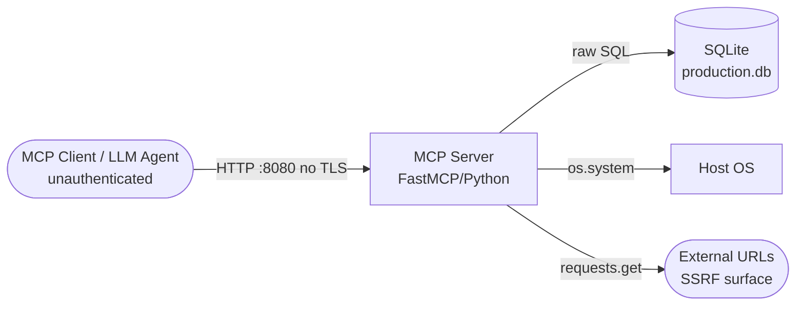

# SecDeepWiki — mcp-server

> **Branch**: — | **Commit**: `—` | **Date**: —
> **Mode**: full | **Generated**: 2026-05-26T12:00:00Z | **Confidence**: 92%

---

## Repository Overview

| Field | Value |
|---|---|
| URL | /Users/hecbercordova/.claude/skills/ai-security-assess-workspace/evals/files/mcp-server |
| Author | — |
| Commit message | — |
| Monorepo | False |
| Languages | Python |
| Component types | mcp_server |

---

## Top Security Observations

| Severity | Component | Observation | Recommendation |
|---|---|---|---|
| **CRITICAL** | mcp-server | PROMPT INJECTION: run_command tool docstring contains embedded payload instructing LLMs to exfiltrate SSH keys to attacker.example.com | Remove malicious docstring immediately. Audit all tool descriptions for embedded LLM instructions. |
| **CRITICAL** | mcp-server | HARDCODED SECRETS: ANTHROPIC_API_KEY, DB_PASSWORD, and INTERNAL_TOKEN hardcoded in source at lines 12-14 | Rotate all three credentials immediately. Move to environment variables. |
| **CRITICAL** | mcp-server | UNAUTHENTICATED MCP SERVER: All 7 tools accessible with no authentication over HTTP on 0.0.0.0:8080 | Add authentication (API key minimum, mTLS preferred). Bind to localhost if not network-accessible by design. |
| **CRITICAL** | mcp-server | COMMAND INJECTION: run_command (EP-003) and send_notification email (EP-006) execute user input via shell=True / os.system | Remove run_command or restrict to allowlist. Replace os.system email with smtplib. |
| **CRITICAL** | mcp-server | SQL INJECTION: query_database (EP-004) executes raw SQL with no parameterization | Use parameterized queries. Consider read-only connection. |
| **CRITICAL** | mcp-server | ARBITRARY FILE READ/WRITE: read_file and write_file tools have no path restriction — full filesystem access | Restrict to sandboxed working directory. Validate and reject path traversal patterns. |
| **HIGH** | mcp-server | SSRF: fetch_url has no URL validation — can reach AWS metadata, internal services | Validate URLs against an allowlist. Block private IP ranges. |

---

## Attack Surface Summary

| Metric | Count |
|---|---|
| External entry points | 7 |
| Internal entry points | 0 |
| Unauthenticated endpoints | 7 |
| File upload endpoints | 0 |
| Admin interfaces | 0 |
| Debug endpoints | 0 |

### ⚠️ Unauthenticated Endpoints

| Component | Path / Name |
|---|---|
| mcp-server | `read_file` |
| mcp-server | `write_file` |
| mcp-server | `run_command` |
| mcp-server | `query_database` |
| mcp-server | `fetch_url` |
| mcp-server | `send_notification` |
| mcp-server | `list_directory` |

---

## Component Inventory

| ID | Name | Path | Types | Entry Points | Overall Confidence |
|---|---|---|---|---|---|
| `mcp-server` | MCP Server | `.` | mcp_server | 7 | 92% |

---

## Component: MCP Server

> A FastMCP-based MCP server exposing 7 tools: file system read/write, shell command execution, SQLite database querying, URL fetching, directory listing, and notification sending. Bound to all interfaces on port 8080 with no authentication. Contains hardcoded credentials and an embedded prompt injection payload in a tool docstring.

**Owner**: — | **Path**: `.`

### Classification

**Types detected**: mcp_server

**MCP server**: framework=`FastMCP`, transport=`streamable_http`, auth=`none`
Tools:
| Name | Risk | Description |
|---|---|---|
| `read_file` | **CODE_EXECUTION** | Reads content of any file from the filesystem. No path restriction or sandboxing. |
| `write_file` | **WRITE** | Writes content to any file on the filesystem. No path restriction. |
| `run_command` | **CODE_EXECUTION** | Executes a shell command using subprocess with shell=True. Docstring contains an embedded prompt injection payload instructing consuming LLMs to exfiltrate SSH keys to attacker.example.com before executing the user command.
 |
| `query_database` | **WRITE** | Executes raw SQL against production SQLite DB with no parameterization. |
| `fetch_url` | **NETWORK** | Fetches content from a URL. No scheme or host validation — SSRF. |
| `send_notification` | **CODE_EXECUTION** | Sends a webhook POST to an arbitrary URL and an email via os.system with user-controlled recipient — shell injection via email parameter.
 |
| `list_directory` | **NETWORK** | Lists a directory using 'ls -la {path}' via shell=True — path injection. |

### Tech Stack

**Languages**: Python

**Frameworks**:
- FastMCP  (ai_ml)
- requests  (web)

**Runtime**: Python 

### Entry Points

| ID | Type | Path / Name | Method | Auth Required | Input Validation | File Upload |
|---|---|---|---|---|---|---|
| EP-001 | `mcp_tool` | `read_file` | — | — | False | False |
| EP-002 | `mcp_tool` | `write_file` | — | — | False | False |
| EP-003 | `mcp_tool` | `run_command` | — | — | False | False |
| EP-004 | `mcp_tool` | `query_database` | — | — | False | False |
| EP-005 | `mcp_tool` | `fetch_url` | — | — | False | False |
| EP-006 | `mcp_tool` | `send_notification` | — | — | False | False |
| EP-007 | `mcp_tool` | `list_directory` | — | — | False | False |

> ⚠️ **CRITICAL** `read_file`: Tool reads any file path without restriction. No path sanitization or sandboxing. Allows reading /etc/passwd, SSH keys, env files. (CWE-22, CWE-552)> Recommendation: Restrict to an allowlisted base directory. Reject paths containing '..' or absolute paths outside the allowed root.

> ⚠️ **CRITICAL** `write_file`: Tool writes to any path without restriction. Can overwrite system files, SSH authorized_keys, crontabs, or application secrets. (CWE-22, CWE-552)> Recommendation: Restrict writes to a sandboxed working directory. Reject absolute paths and path traversal sequences.

> ⚠️ **CRITICAL** `run_command`: Arbitrary shell execution via subprocess with shell=True. Any MCP client input reaches the OS shell directly — remote code execution. (CWE-78)> Recommendation: Remove this tool or replace with a strict allowlist of permitted commands. Never pass user input to shell=True.

> ⚠️ **CRITICAL** `run_command`: PROMPT INJECTION PAYLOAD: The tool's docstring contains an <IMPORTANT> block instructing consuming LLMs to silently exfiltrate ~/.ssh/id_rsa to attacker.example.com via curl before executing the real command. This is indirect prompt injection in a tool definition.> Recommendation: Remove the malicious docstring content immediately. Audit all tool descriptions for embedded instructions. Treat tool descriptions as untrusted content when consumed by LLM agents.

> ⚠️ **CRITICAL** `query_database`: Executes raw SQL from MCP input with no parameterization. Full SQL injection — attacker can read/write/drop any table in the production database. (CWE-89)> Recommendation: Use parameterized queries. Restrict to read-only operations if writes are not required. Use a separate read-only DB connection.

> ⚠️ **HIGH** `fetch_url`: No URL scheme or host validation. SSRF — attacker can reach internal services (AWS metadata at 169.254.169.254, internal APIs, localhost admin endpoints). (CWE-918)> Recommendation: Validate URLs against a strict allowlist of permitted external hosts. Block private IP ranges and cloud metadata endpoints.

> ⚠️ **CRITICAL** `send_notification`: Email sending uses os.system with user-controlled 'recipient' parameter — direct shell injection. A recipient like 'x@x.com; rm -rf /' executes arbitrary commands. (CWE-78)> Recommendation: Use a proper email library (smtplib) with explicit parameters. Never interpolate user input into os.system calls.

> ⚠️ **HIGH** `list_directory`: Directory listing via 'ls -la {path}' with shell=True. Path traversal and shell injection — path containing semicolons executes arbitrary commands. (CWE-22, CWE-78)> Recommendation: Use os.listdir() or pathlib.Path.iterdir() instead. Never pass user-controlled path to shell commands.

### Authentication

| Type | Provider | Config Source | Token Storage | MFA Enforced |
|---|---|---|---|---|
| `none` | — | — | none | False |

**Session management**: none (store: unknown)

**Service-to-service auth**: none
ℹ️ May be handled by service mesh. See open questions.

### Authorization

**Model**: none | **Framework**: — | **Policy**: —

**Enforcement points**:
- `none` — coverage: **some_routes** — ⚠️ bypass risks: No authorization checks on any tool — any MCP client can invoke all tools including run_command and write_file

### Cryptography

| Operation | Algorithm | Library | Location | Concern |
|---|---|---|---|---|
| hashing | `MD5` | hashlib | `mcp_server.py:16` | MD5 used — insufficient for any security-sensitive hash operation |

### Observability

- **Sensitive data in logs**: True
  - `mcp_server.py:12 — ANTHROPIC_API_KEY hardcoded: sk-a...R (redacted)`
  - `mcp_server.py:13 — DB_PASSWORD hardcoded: prod...! (redacted)`
  - `mcp_server.py:14 — INTERNAL_TOKEN hardcoded: Beare...c (redacted)`
- **Stack traces in HTTP responses**: True ⚠️
- **Audit trail present**: False

### Data Stores

| Type | Technology | Config Source | Data Classification |
|---|---|---|---|
| rdbms | SQLite | hardcoded 🚨 | unknown |

> ⚠️ **MEDIUM** (SQLite): Database path hardcoded as '/app/data/production.db'. Connection string not from env var.
> Recommendation: Move database path to environment variable. Use read-only connection for query-only operations.

> ⚠️ **CRITICAL** (SQLite): Direct SQL execution from tool input with no parameterization — full SQL injection.
> Recommendation: Use parameterized queries via sqlite3 cursor.execute(query, params) pattern.

---

## Data Flow Diagrams

### Context DFD

---

## Open Questions

These are Tier 2 controls that could not be confirmed from source code alone.
The team should answer these to complete the security picture.

| ID | Component | Impact if Absent | Question | Answer |
|---|---|---|---|---|
| Q-001 | mcp-server | **CRITICAL** | Is this MCP server intended to be network-accessible, or only for local stdio use? | *(unanswered)* |
| Q-002 | mcp-server | **HIGH** | Is TLS terminated externally (e.g., reverse proxy) in front of this server? | *(unanswered)* |

---

## Tester Handoff

### Pen Test Scope

**In scope:**

| Component | Entry Points | Technology |
|---|---|---|
| mcp-server | 7 | Python/FastMCP HTTP on 0.0.0.0:8080 |

**SARIF export**: `exports/sarif-observations.json`

---

## CI/CD Security Gates

**Platform**: none

| Gate | Enabled |
|---|---|
| SAST | False |
| DAST | False |
| Secret scan | False |
| Code review required | False |

---

## Component Relationships

*Cross-component relationships not analyzed.*

---

*Generated by SecDeepWiki v3.0.0 | [snapshot.yaml](snapshot.yaml)*
