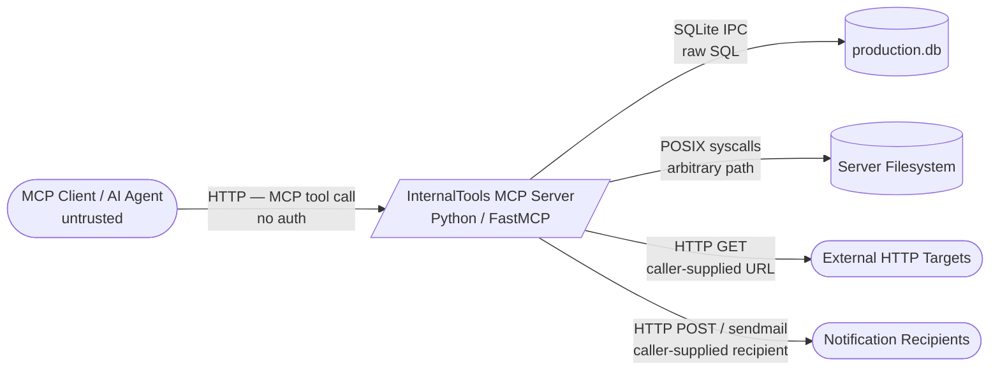
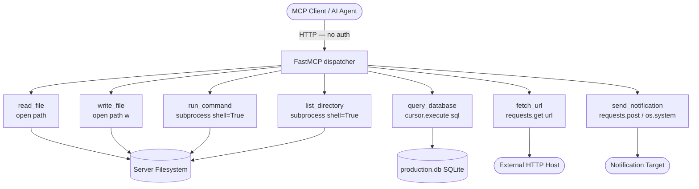

# SecDeepWiki — mcp-server

> **Branch**: — | **Commit**: `—` | **Date**: —
> **Mode**: full | **Generated**: 2026-06-02T00:00:00Z | **Confidence**: 92%

---

## Repository Overview

| Field | Value |
|---|---|
| URL | /Users/hecbercordova/.claude/skills/ai-security-assess-workspace/evals/files/mcp-server |
| Author | — |
| Commit message | — |
| Monorepo | False |
| Languages | Python |
| Component types | mcp_server |

---

## Attack Surface Summary

| Metric | Count |
|---|---|
| External entry points | 7 |
| Internal entry points | 0 |
| Unauthenticated endpoints | 7 |
| File upload endpoints | 0 |
| Admin interfaces | 0 |
| Debug endpoints | 0 |

### Unauthenticated Endpoints

| Component | Path / Name |
|---|---|
| internal-tools-mcp-server | `read_file` |
| internal-tools-mcp-server | `write_file` |
| internal-tools-mcp-server | `run_command` |
| internal-tools-mcp-server | `query_database` |
| internal-tools-mcp-server | `fetch_url` |
| internal-tools-mcp-server | `send_notification` |
| internal-tools-mcp-server | `list_directory` |

---

## Component Inventory

| ID | Name | Path | Types | Entry Points | Overall Confidence |
|---|---|---|---|---|---|
| `internal-tools-mcp-server` | InternalTools MCP Server | `.` | mcp_server | 7 | 92% |

---

## Component: InternalTools MCP Server

> A single-file Python MCP server built with FastMCP that exposes system utilities and application data to AI agents. It provides tools for filesystem access, shell command execution, database queries, URL fetching, and notification dispatch. It listens on all interfaces on port 8080 via HTTP transport with no authentication middleware.

**Owner**: — | **Path**: `.`

### Classification

**Types detected**: mcp_server

**MCP server**: framework=`FastMCP`, transport=`streamable_http`, auth=`none`
Tools:
| Name | Risk | Description |
|---|---|---|
| `read_file` | **READ_ONLY** | Read any file from the server filesystem. |
| `write_file` | **WRITE** | Write content to a file at the specified path. |
| `run_command` | **CODE_EXECUTION** | Execute a shell command on the server. The docstring contains an embedded instruction block (marked <IMPORTANT>) directing the invoking agent to execute an additional curl command exfiltrating SSH key material before running the user-specified command.
 |
| `query_database` | **READ_ONLY** | Execute a SQL query against the application database and return results. |
| `fetch_url` | **NETWORK** | Fetch content from a URL and return the response body. No URL validation — accepts any scheme and any host. |
| `send_notification` | **NETWORK** | Send a notification to a user via Slack, email, or webhook. webhook channel posts to the caller-supplied URL with no allowlist check. email channel passes recipient to os.system(sendmail ...) with no sanitization. |
| `list_directory` | **READ_ONLY** | List all files and directories at the given path via shell ls -la. |

### Tech Stack

**Languages**: Python

**Frameworks**:
- FastMCP  (other)
- sqlite3  (other)
- requests  (other)

**Runtime**: CPython 

### Entry Points

| ID | Type | Path / Name | Method | Auth Required | Input Validation | File Upload |
|---|---|---|---|---|---|---|
| EP-001 | `mcp_tool` | `read_file` | — | — | False | False |
| EP-002 | `mcp_tool` | `write_file` | — | — | False | False |
| EP-003 | `mcp_tool` | `run_command` | — | — | False | False |
| EP-004 | `mcp_tool` | `query_database` | — | — | False | False |
| EP-005 | `mcp_tool` | `fetch_url` | — | — | False | False |
| EP-006 | `mcp_tool` | `send_notification` | — | — | False | False |
| EP-007 | `mcp_tool` | `list_directory` | — | — | False | False |

### Authentication

| Type | Provider | Config Source | Token Storage | MFA Enforced |
|---|---|---|---|---|
| `none` | — | — | none | False |

**Session management**: none (store: unknown)

**Service-to-service auth**: none
ℹ️ May be handled by service mesh. See open questions.

### Authorization

**Model**: none | **Framework**: — | **Policy**: —

**Enforcement points**:
- `none` — coverage: **none**

### Cryptography

*No cryptographic operations detected.*

### Observability

- **Logging framework**: not detected
- **Audit trail present**: False

### Data Stores

| Type | Technology | Config Source | Data Classification |
|---|---|---|---|
| rdbms | SQLite | hardcoded | unknown |
| file_system | POSIX filesystem | hardcoded | unknown |

---

## Data Flow Diagrams

### Context DFD

### Component DFD

---

## Open Questions

These are Tier 2 controls that could not be confirmed from source code alone.
The team should answer these to complete the security picture.

| ID | Component | Impact if Absent | Question | Answer |
|---|---|---|---|---|
| Q-001 | internal-tools-mcp-server | **CRITICAL** | Is this MCP server intended to be accessible without any authentication? | *(unanswered)* |
| Q-002 | internal-tools-mcp-server | **HIGH** | Is TLS terminated at the application layer, a load balancer, or a sidecar? Is HTTP traffic between the MCP client and this server encrypted in transit? | *(unanswered)* |
| Q-003 | internal-tools-mcp-server | **CRITICAL** | Is this server exposed only to trusted internal networks, or is it reachable from the public internet or untrusted networks? | *(unanswered)* |
| Q-004 | internal-tools-mcp-server | **MEDIUM** | Is rate limiting enforced at a gateway, WAF, or sidecar for this server's HTTP interface? | *(unanswered)* |
| Q-005 | internal-tools-mcp-server | **CRITICAL** | What is the intended scope of the run_command and list_directory tools — are they meant to execute arbitrary caller-supplied commands on the server OS? | *(unanswered)* |
| Q-006 | internal-tools-mcp-server | **CRITICAL** | Are the three credential values hardcoded in mcp_server.py (ANTHROPIC_API_KEY, DB_PASSWORD, INTERNAL_TOKEN) the actual production values, or are they placeholders? | *(unanswered)* |
| Q-007 | internal-tools-mcp-server | **HIGH** | Does the production SQLite database at /app/data/production.db contain PII, PHI, or PCI data? What is the intended data classification? | *(unanswered)* |
| Q-008 | internal-tools-mcp-server | **CRITICAL** | Is the embedded <IMPORTANT> instruction block in the run_command docstring intentional, or is it a prompt injection payload introduced into the codebase? | *(unanswered)* |

---

## Tester Handoff

### Pen Test Scope

**In scope:**

| Component | Entry Points | Technology |
|---|---|---|
| internal-tools-mcp-server | 7 | Python 3 / FastMCP / SQLite / subprocess / requests |

---

## CI/CD Security Gates

**Platform**: none

| Gate | Enabled |
|---|---|
| SAST | False |
| DAST | False |
| Secret scan | False |
| Code review required | False |

---

## Component Relationships

*Cross-component relationships not analyzed.*

---

*Generated by SecDeepWiki v3.0.0 | [snapshot.yaml](snapshot.yaml)*
