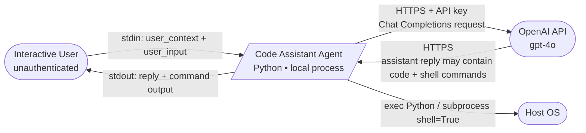
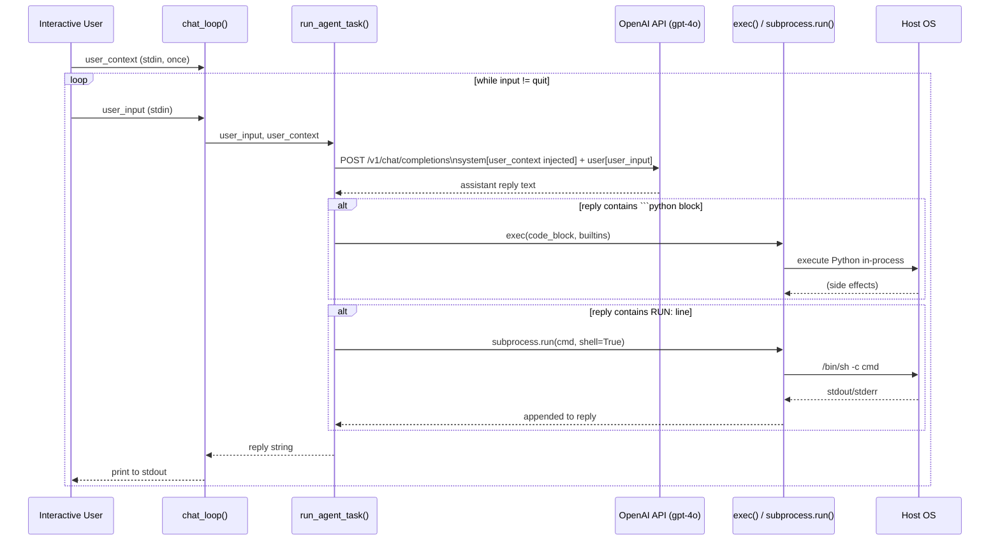

# SecDeepWiki — ai-agent

> **Branch**: — | **Commit**: `—` | **Date**: —
> **Mode**: full | **Generated**: 2026-06-03T00:00:00Z | **Confidence**: 85%

---

## Repository Overview

| Field | Value |
|---|---|
| URL | /Users/hecbercordova/.claude/skills/ai-security-assess-workspace/evals/files/ai-agent |
| Author | — |
| Commit message | — |
| Monorepo | False |
| Languages | Python |
| Component types | ai_agent, cli_tool |

---

## Attack Surface Summary

| Metric | Count |
|---|---|
| External entry points | 2 |
| Internal entry points | 1 |
| Unauthenticated endpoints | 3 |
| File upload endpoints | 0 |
| Admin interfaces | 0 |
| Debug endpoints | 0 |

### Unauthenticated Endpoints

| Component | Path / Name |
|---|---|
| code-assistant-agent | `chat_loop` |
| code-assistant-agent | `run_agent_task — user_input parameter` |
| code-assistant-agent | `run_agent_task — user_context parameter` |

---

## Component Inventory

| ID | Name | Path | Types | Entry Points | Overall Confidence |
|---|---|---|---|---|---|
| `code-assistant-agent` | Code Assistant Agent | `.` | ai_agent, cli_tool | 3 | 85% |

---

## Component: Code Assistant Agent

> A single-file Python CLI application that implements an interactive coding assistant. The agent sends user messages to the OpenAI Chat Completions API (model: gpt-4o), then autonomously executes any Python code blocks or shell commands that appear verbatim in the LLM response. Source comment notes the agent is being extended to serve external contractors in a future sprint.

**Owner**: — | **Path**: `.`

### Classification

**Types detected**: ai_agent, cli_tool

**AI agent**: framework=`custom`
Models referenced:
- `openai/gpt-4o` — API key from: **hardcoded**

Tools defined:
- **python_code_exec** (code_exec): Executes Python code blocks extracted from the LLM response using exec(). Code is parsed from triple-backtick python fences in the assistant reply and passed to exec() with the full process builtins in scope.

- **shell_command_exec** (code_exec): Executes shell commands extracted from the LLM response using subprocess.run() with shell=True. Commands are identified by the literal prefix "RUN: " in the assistant reply text.

RAG: False | Memory: none | Guardrails: False

### Tech Stack

**Languages**: Python

**Frameworks**:
- openai  (ai_ml)

**Runtime**: Python 

### Entry Points

| ID | Type | Path / Name | Method | Auth Required | Input Validation | File Upload |
|---|---|---|---|---|---|---|
| EP-001 | `cli_command` | `chat_loop` | — | — | False | False |
| EP-002 | `user_interface_action` | `run_agent_task — user_input parameter` | — | — | False | False |
| EP-003 | `user_interface_action` | `run_agent_task — user_context parameter` | — | — | False | False |

### Authentication

| Type | Provider | Config Source | Token Storage | MFA Enforced |
|---|---|---|---|---|
| `none` | — | — | none | False |

**Session management**: none (store: unknown)

**Credential storage**: hashing=`None`

**Service-to-service auth**: api_key

### Authorization

**Model**: none | **Framework**: — | **Policy**: —

**Enforcement points**:
- `none` — coverage: **none**

### Cryptography

*No cryptographic operations detected.*

### Observability

- **Logging framework**: not detected
- **Audit trail present**: False

### Data Stores

*No data stores detected.*

---

## Data Flow Diagrams

### Context DFD

### Component DFD

---

## CI/CD Security Gates

**Platform**: none

| Gate | Enabled |
|---|---|
| SAST | False |
| DAST | False |
| Secret scan | False |
| Code review required | False |

---

## Component Relationships

*Cross-component relationships not analyzed.*

---

*Generated by SecDeepWiki v3.0.0 | [snapshot.yaml](snapshot.yaml)*
