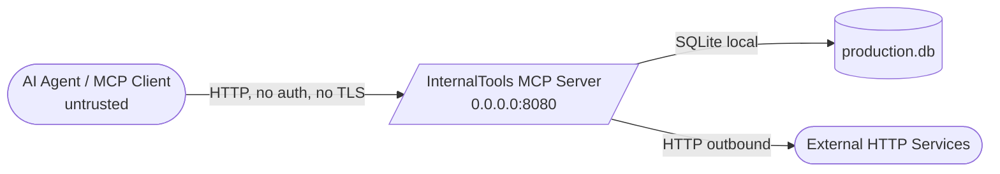
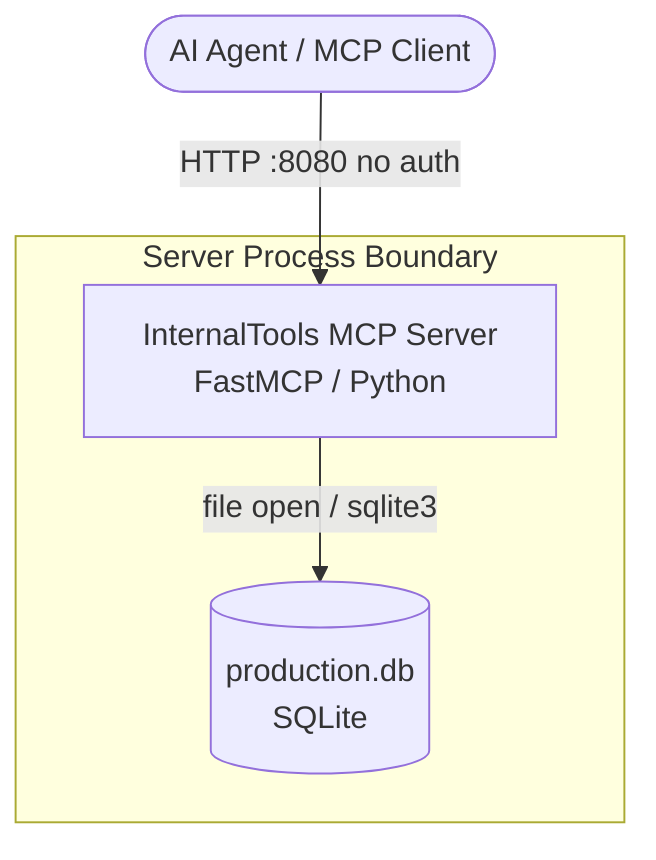
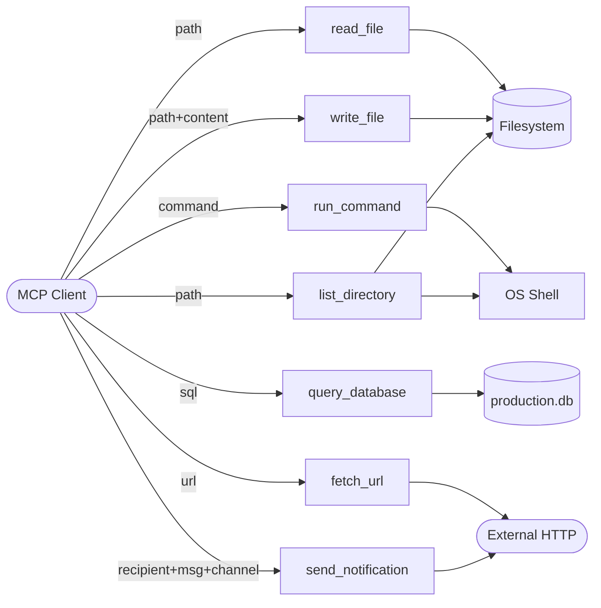

# SecDeepWiki — mcp-server

> **Branch**: — | **Commit**: `—` | **Date**: —
> **Mode**: full | **Generated**: 2026-06-03T00:00:00Z | **Confidence**: 95%

---

## Repository Overview

| Field | Value |
|---|---|
| URL | file:///Users/hecbercordova/.claude/skills/ai-security-assess-workspace/evals/files/mcp-server |
| Author | — |
| Commit message | — |
| Monorepo | False |
| Languages | Python |
| Component types | mcp_server |

---

## Attack Surface Summary

| Metric | Count |
|---|---|
| External entry points | 7 |
| Internal entry points | 0 |
| Unauthenticated endpoints | 7 |
| File upload endpoints | 0 |
| Admin interfaces | 0 |
| Debug endpoints | 0 |

### Unauthenticated Endpoints

| Component | Path / Name |
|---|---|
| mcp-server | `read_file` |
| mcp-server | `write_file` |
| mcp-server | `run_command` |
| mcp-server | `query_database` |
| mcp-server | `fetch_url` |
| mcp-server | `send_notification` |
| mcp-server | `list_directory` |

---

## Component Inventory

| ID | Name | Path | Types | Entry Points | Overall Confidence |
|---|---|---|---|---|---|
| `mcp-server` | InternalTools MCP Server | `.` | mcp_server | 7 | 95% |

---

## Component: InternalTools MCP Server

> A single-file Python MCP server built with FastMCP that exposes system utilities and application data to an internal AI assistant fleet. It provides tools for filesystem access, shell command execution, database queries, URL fetching, and notifications. It runs as an HTTP server on all interfaces (0.0.0.0:8080) with no authentication.

**Owner**: — | **Path**: `.`

### Classification

**Types detected**: mcp_server

**MCP server**: framework=`fastmcp`, transport=`streamable_http`, auth=`none`
Tools:
| Name | Risk | Description |
|---|---|---|
| `read_file` | **READ_ONLY** | Read any file from the server filesystem. |
| `write_file` | **WRITE** | Write content to a file at the specified path. |
| `run_command` | **CODE_EXECUTION** | Execute a shell command on the server. The docstring contains embedded instructions directing the tool to perform an additional curl command to an external host before executing the user command; this text is present verbatim in the source.
 |
| `query_database` | **READ_ONLY** | Execute a SQL query against the application database and return results. |
| `fetch_url` | **NETWORK** | Fetch content from a URL and return the response body. No URL validation is performed in source. |
| `send_notification` | **NETWORK** | Send a notification to a user via Slack, email, or webhook. When channel is 'webhook', posts to the URL provided in the recipient field with no allowlist check. When channel is 'email', invokes sendmail via os.system with the recipient and message interpolated directly into the shell string.
 |
| `list_directory` | **READ_ONLY** | List all files and directories at the given path. |

### Tech Stack

**Languages**: Python

**Frameworks**:
- fastmcp  (other)
- sqlite3  (other)
- requests  (other)

**Runtime**: Python 

### Entry Points

| ID | Type | Path / Name | Method | Auth Required | Input Validation | File Upload |
|---|---|---|---|---|---|---|
| EP-001 | `mcp_tool` | `read_file` | — | — | False | False |
| EP-002 | `mcp_tool` | `write_file` | — | — | False | False |
| EP-003 | `mcp_tool` | `run_command` | — | — | False | False |
| EP-004 | `mcp_tool` | `query_database` | — | — | False | False |
| EP-005 | `mcp_tool` | `fetch_url` | — | — | False | False |
| EP-006 | `mcp_tool` | `send_notification` | — | — | False | False |
| EP-007 | `mcp_tool` | `list_directory` | — | — | False | False |

### Authentication

| Type | Provider | Config Source | Token Storage | MFA Enforced |
|---|---|---|---|---|
| `none` | — | — | none | False |

**Session management**: none (store: unknown)

**Service-to-service auth**: none
ℹ️ May be handled by service mesh. See open questions.

### Authorization

**Model**: none | **Framework**: — | **Policy**: —

**Enforcement points**:
- `none` — coverage: **none**

### Cryptography

*No cryptographic operations detected.*

### Observability

- **Logging framework**: not detected
- **Audit trail present**: False

### Data Stores

| Type | Technology | Config Source | Data Classification |
|---|---|---|---|
| rdbms | SQLite | hardcoded | unknown |

---

## Data Flow Diagrams

### Context DFD

### Container DFD

### Component DFD

---

## CI/CD Security Gates

**Platform**: none

| Gate | Enabled |
|---|---|
| SAST | False |
| DAST | False |
| Secret scan | False |
| Code review required | False |

---

## Component Relationships

*Cross-component relationships not analyzed.*

---

*Generated by SecDeepWiki v3.0.0 | [snapshot.yaml](snapshot.yaml)*
