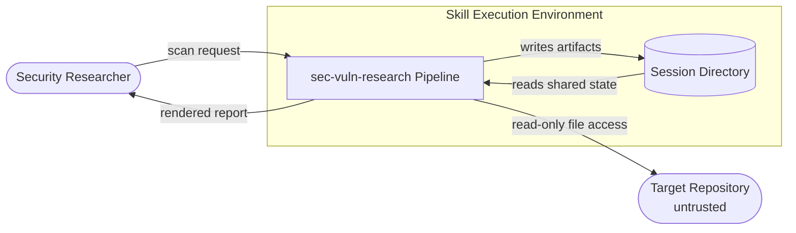
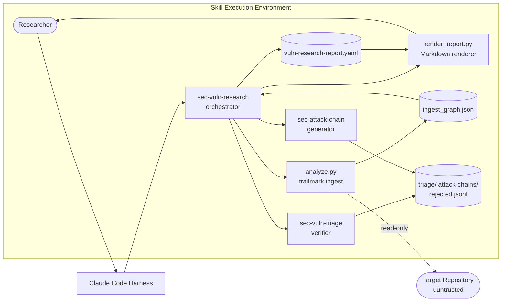

# SecDeepWiki — sec-vuln-research

> **Branch**: FEAT/Add-Sec-Vuln-Discovery | **Commit**: `cfe609975c7a` | **Date**: 2026-06-02T07:14:51-04:00
> **Mode**: full | **Generated**: 2026-06-03T00:00:00Z | **Confidence**: 82%

---

## Repository Overview

| Field | Value |
|---|---|
| URL | — |
| Author | hecber@gmail.com |
| Commit message | FEATURE | Add sec vuln discovery (#8) |
| Monorepo | False |
| Languages | Python, Markdown, YAML, Jinja2 |
| Component types | agent_skill_plugin, cli_tool, library_or_sdk |

---

## Attack Surface Summary

| Metric | Count |
|---|---|
| External entry points | 2 |
| Internal entry points | 3 |
| Unauthenticated endpoints | 5 |
| File upload endpoints | 1 |
| Admin interfaces | 0 |
| Debug endpoints | 0 |

### Unauthenticated Endpoints

| Component | Path / Name |
|---|---|
| sec-vuln-research-skill | `analyze.py <target_path> --output <path> [--sarif <path>]` |
| sec-vuln-research-skill | `render_report.py <yaml_file> [--output <path>]` |
| sec-vuln-research-skill | `sec-vuln-research (SKILL.md)` |
| sec-vuln-triage-skill | `sec-vuln-triage (SKILL.md)` |
| sec-attack-chain-skill | `sec-attack-chain (SKILL.md)` |

### File Upload Endpoints

| Component | Path / Name |
|---|---|
| sec-vuln-research-skill | `render_report.py <yaml_file> [--output <path>]` |

---

## Component Inventory

| ID | Name | Path | Types | Entry Points | Overall Confidence |
|---|---|---|---|---|---|
| `sec-vuln-research-plugin` | sec-vuln-research Plugin | `.` | library_or_sdk | 0 | 90% |
| `sec-vuln-research-skill` | sec-vuln-research Skill | `skills/sec-vuln-research` | ai_agent, cli_tool | 3 | 82% |
| `sec-vuln-triage-skill` | sec-vuln-triage Skill | `skills/sec-vuln-triage` | ai_agent | 1 | 85% |
| `sec-attack-chain-skill` | sec-attack-chain Skill | `skills/sec-attack-chain` | ai_agent | 1 | 85% |

---

## Component: sec-vuln-research Plugin

> Top-level Claude Code agent plugin that packages three coordinated security skills (sec-vuln-research, sec-vuln-triage, sec-attack-chain) under a single plugin manifest. Provides no executable code at this level; its role is to register skill metadata with the Claude Code harness and supply shared documentation.

**Owner**: — | **Path**: `.`

### Classification

**Types detected**: library_or_sdk

### Tech Stack

**Languages**: None

### Entry Points

*No entry points detected.*

### Authentication

*No authentication mechanisms detected.*

**Session management**: none (store: none)

**Service-to-service auth**: none
ℹ️ May be handled by service mesh. See open questions.

### Authorization

**Model**: none | **Framework**: — | **Policy**: —

### Cryptography

*No cryptographic operations detected.*

### Observability

- **Logging framework**: not detected
- **Audit trail present**: False

### Data Stores

*No data stores detected.*

---
## Component: sec-vuln-research Skill

> Multi-stage LLM-driven vulnerability research pipeline orchestrator. Coordinates eight stages (graph build via trailmark, file ranking, context generation, four specialist hunters, adversarial triage, variant analysis, attack chain generation, and report production). Contains the analyze.py ingest script, render_report.py renderer, a Jinja2 report template, and a YAML report template. This is the primary entry point for the plugin's vulnerability-finding capability.

**Owner**: — | **Path**: `skills/sec-vuln-research`

### Classification

**Types detected**: ai_agent, cli_tool

**AI agent**: framework=`custom`
Models referenced:
- `anthropic/None` — API key from: **None**

Tools defined:
- **read_file** (file_access): Read source file content at a given path
- **search_code** (file_access): Run ripgrep pattern search across the target repository
- **resolve_symbol** (file_access): Resolve a named constant to its numeric value
- **trace_callers** (file_access): Walk backward from a function to find its callers
- **trace_callees** (file_access): Walk forward from a function to find its callees
RAG: False | Memory: file_system | Guardrails: True

### Tech Stack

**Languages**: Python, Python, Markdown, YAML, Jinja2

**Frameworks**:
- trailmark >=0.1 (security)
- jinja2 >=3.1 (other)
- pyyaml >=6.0 (other)

**Runtime**: Python >=3.11

### Entry Points

| ID | Type | Path / Name | Method | Auth Required | Input Validation | File Upload |
|---|---|---|---|---|---|---|
| EP-001 | `cli_command` | `analyze.py <target_path> --output <path> [--sarif <path>]` | — | — | True | False |
| EP-002 | `cli_command` | `render_report.py <yaml_file> [--output <path>]` | — | — | True | True |
| EP-003 | `plugin_hook` | `sec-vuln-research (SKILL.md)` | — | — | False | False |

### Authentication

| Type | Provider | Config Source | Token Storage | MFA Enforced |
|---|---|---|---|---|
| `none` | — | — | none | False |

**Session management**: none (store: none)

**Service-to-service auth**: none
ℹ️ May be handled by service mesh. See open questions.

### Authorization

**Model**: none | **Framework**: — | **Policy**: —

### Cryptography

*No cryptographic operations detected.*

### Observability

- **Logging framework**: not detected
- **Audit trail present**: False

### Data Stores

| Type | Technology | Config Source | Data Classification |
|---|---|---|---|
| file_system | local file system | — | internal |

---
## Component: sec-vuln-triage Skill

> Adversarial multi-round triage verifier. Accepts a vulnerability finding (JSON dict, CVE description, or bug report), independently challenges it across four axes (Real, Triggerable, Impactful, Novel) over N rounds plus an arbiter round, and emits a confidence-scored verdict (VALID / INVALID / UNCERTAIN). Can be invoked automatically by sec-vuln-research or as a standalone skill. Contains only a SKILL.md with no executable scripts.

**Owner**: — | **Path**: `skills/sec-vuln-triage`

### Classification

**Types detected**: ai_agent

**AI agent**: framework=`custom`
Models referenced:
- `anthropic/None` — API key from: **None**

Tools defined:
- **read_file** (file_access): Read file content at the reported vulnerability location (±30 lines)
- **search_code** (file_access): Run ripgrep to verify evidence cited in the finding
- **trace_callers** (file_access): Walk the call graph backward to verify reachability
RAG: False | Memory: file_system | Guardrails: True

### Tech Stack

**Languages**: Markdown

### Entry Points

| ID | Type | Path / Name | Method | Auth Required | Input Validation | File Upload |
|---|---|---|---|---|---|---|
| EP-004 | `plugin_hook` | `sec-vuln-triage (SKILL.md)` | — | — | False | False |

### Authentication

| Type | Provider | Config Source | Token Storage | MFA Enforced |
|---|---|---|---|---|
| `none` | — | — | none | False |

**Session management**: none (store: none)

**Service-to-service auth**: none
ℹ️ May be handled by service mesh. See open questions.

### Authorization

**Model**: none | **Framework**: — | **Policy**: —

### Cryptography

*No cryptographic operations detected.*

### Observability

- **Logging framework**: not detected
- **Audit trail present**: False

### Data Stores

| Type | Technology | Config Source | Data Classification |
|---|---|---|---|
| file_system | local file system | — | internal |

---
## Component: sec-attack-chain Skill

> Generates structured attack chain documents for confirmed security vulnerabilities. Traces the real entry point backward through the call graph (using trailmark graph data when available, grep-based tracing as fallback), documents exploitation steps, assesses severity on four dimensions, and writes a functional PoC skeleton. Produces a Markdown attack chain document and populates the attack_chain block in the YAML report. Contains SKILL.md and an attack chain Markdown template; no executable scripts.

**Owner**: — | **Path**: `skills/sec-attack-chain`

### Classification

**Types detected**: ai_agent

**AI agent**: framework=`custom`
Models referenced:
- `anthropic/None` — API key from: **None**

Tools defined:
- **read_file** (file_access): Read the full function containing the vulnerability and surrounding context
- **trace_callers** (file_access): Walk backward from the vulnerable function to find public entry points
- **resolve_symbol** (file_access): Resolve named constants (buffer sizes, limits) to numeric values
- **engine_entrypoint_paths_to** (file_access): Use trailmark graph to enumerate all paths from attack surface to vulnerable function
RAG: False | Memory: file_system | Guardrails: True

### Tech Stack

**Languages**: Markdown

### Entry Points

| ID | Type | Path / Name | Method | Auth Required | Input Validation | File Upload |
|---|---|---|---|---|---|---|
| EP-005 | `plugin_hook` | `sec-attack-chain (SKILL.md)` | — | — | False | False |

### Authentication

| Type | Provider | Config Source | Token Storage | MFA Enforced |
|---|---|---|---|---|
| `none` | — | — | none | False |

**Session management**: none (store: none)

**Service-to-service auth**: none
ℹ️ May be handled by service mesh. See open questions.

### Authorization

**Model**: none | **Framework**: — | **Policy**: —

### Cryptography

*No cryptographic operations detected.*

### Observability

- **Logging framework**: not detected
- **Audit trail present**: False

### Data Stores

| Type | Technology | Config Source | Data Classification |
|---|---|---|---|
| file_system | local file system | — | internal |

---

## Data Flow Diagrams

### Context DFD

### Container DFD

---

## CI/CD Security Gates

**Platform**: none

| Gate | Enabled |
|---|---|
| SAST | False |
| DAST | False |
| Secret scan | False |
| Code review required | False |

---

## Component Relationships

| Source | Type | Target | Protocol | Auth | Data Class | Trust Boundary |
|---|---|---|---|---|---|---|
| sec-vuln-research-skill | `calls_api` | sec-vuln-triage-skill | skill invocation (Claude Code harness) | none | internal | False |
| sec-vuln-research-skill | `calls_api` | sec-attack-chain-skill | skill invocation (Claude Code harness) | none | internal | False |
| sec-vuln-research-skill | `reads_from_store` | sec-vuln-research-skill | local file system | none | internal | False |
| sec-vuln-triage-skill | `writes_to_store` | sec-vuln-research-skill | local file system | none | internal | False |
| sec-attack-chain-skill | `writes_to_store` | sec-vuln-research-skill | local file system | none | internal | False |

---

*Generated by SecDeepWiki v3.0.0 | [snapshot.yaml](snapshot.yaml)*
